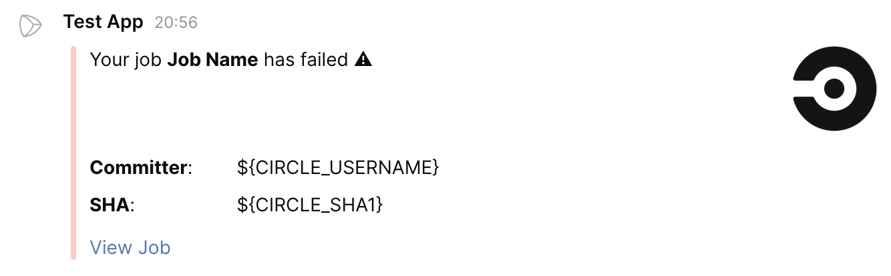
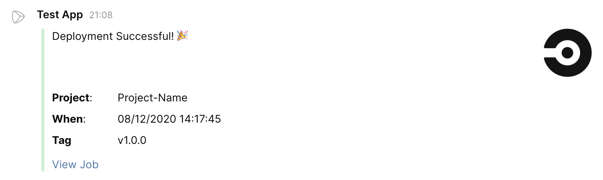
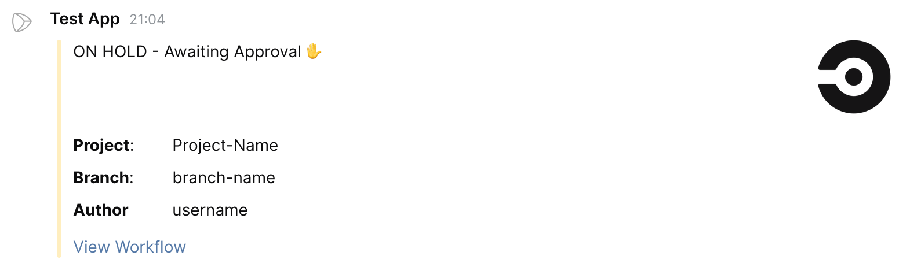

# JetBrains Space Orb [](https://circleci.com/gh/ark-1/jetbrains-space-orb) [](https://circleci.com/orbs/registry/orb/ark-1/jetbrains-space-orb) [](https://raw.githubusercontent.com/ark-1/jetbrains-space-orb/master/LICENSE) [](https://discuss.circleci.com/c/ecosystem/orbs)
                      

Send JetBrains Space chat notifications from your CircleCI pipelines even easier with JetBrains Space Orb.
Was largely based on [circleci/slack](https://github.com/CircleCI-Public/slack-orb) orb

[What are Orbs?](https://circleci.com/orbs/)

## Usage

### Setup

In order to use the JetBrains Space Orb on CircleCI you will need to:
 * Create a [Service Account](https://www.jetbrains.com/help/space/applications.html) in Space.
 * Create a Context on CircleCI. \
   *A context is a storage container for a bucket of environment variables. We can attach multiple contexts to a job and restrict access to certain contexts if needed.*
 * Create three environment variables within your context:

    | Env var name | Value |
    | --- | --- |
    | JB_SPACE_CLIENT_ID | The client ID of a service account created in the previous steps. |
    | JB_SPACE_CLIENT_SECRET | The client secret of a service account created in the previous steps. |
    | JB_SPACE_URL | URL of your Space instance, for example https://example.jetbrains.space |
 * Optionally, set one of two following environment variables:
 
    | Env var name | Value |
    | --- | --- |
    | JB_SPACE_DEFAULT_CHANNEL | If no channel or recipient profile is specified, the notification will be posted in a channel with this name. Can be multiple names, separated by commas. |
    | JB_SPACE_DEFAULT_RECIPIENT_PROFILE | If no channel or recipient profile is specified, the notification will be sent to a person with this username. Can be multiple usernames, separated by commas. |

### Use In Config

For full usage guidelines, see the [orb registry listing](http://circleci.com/orbs/registry/orb/ark-1/jetbrains-space-orb).

## Templates

The JetBrains Space Orb comes with a number of included templates to get your started with minimal setup. Feel free to use an included template or create your own.

| Template Preview  | Template  | Description |
| ------------- | ------------- | ------------- |
|   | basic_fail_1   | Should be used with the "fail" event. |
|   | success_tagged_deploy_1   | To be used in the event of a successful deployment job. _see orb [usage examples](https://circleci.com/developer/orbs/orb/ark-1/jetbrains-space-orb#usage-examples)_ |
|   | basic_on_hold_1   | To be used in the on-hold job. _see orb [usage examples](https://circleci.com/developer/orbs/orb/ark-1/jetbrains-space-orb#usage-examples)_  |


## Custom Message Template

  1. Open HTTP API Playground in Space (in the sidebar).
  2. Find "Chats / Channels / Send Message" endpoint and create your message template using "UI Preview" tab.
  3. Replace any placeholder values with $ENV environment variable strings.
  4. Switch to "IntelliJ IDEA" tab and copy the value of "contents" property here.
  4. Set the resulting code as the value for your `custom` parameter.

  ```yaml
- slack/notify:
      event: always
      custom: |
        {
          "className": "ChatMessage.Block",
          "sections": [
            {
              "className": "MessageSection",
              "elements": [
                {
                  "className": "MessageText",
                  "content": "**This is a text notification**"
                }
              ]
            }
          ]
        }
  ```


## Branch Filtering

Limit notifications to particular branches with the "branch_pattern" parameter.

Enter a comma separated list of regex matchable branch names. Notifications will only be sent if sent from a job from these branches. By default ".+" will be used to match all branches. Pattern must match the full string, no partial matches.


See [usage examples](https://circleci.com/developer/orbs/orb/ark-1/jetbrains-space-orb#usage-examples).

---

## Contributing

We welcome [issues](https://github.com/ark-1/jetbrains-space-orb/issues) to and [pull requests](https://github.com/ark-1/jetbrains-space-orb/pulls) against this repository!
